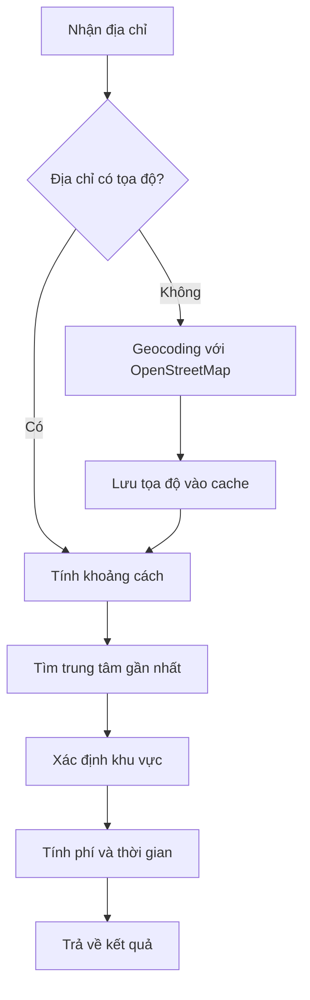

# 🚚 Hệ Thống Tính Phí Vận Chuyển - TuHuBread

## 📋 Mục Lục

- [Tổng Quan](#-tổng-quan)
- [Tính Năng Chính](#-tính-năng-chính)
- [Công Nghệ Sử Dụng](#-công-nghệ-sử-dụng)
- [Cấu Hình Khu Vực](#-cấu-hình-khu-vực)
- [API Documentation](#-api-documentation)
- [Cách Thức Hoạt Động](#-cách-thức-hoạt-động)
- [Ví Dụ Sử Dụng](#-ví-dụ-sử-dụng)
- [Troubleshooting](#-troubleshooting)

## 🌟 Tổng Quan

Hệ thống tính phí vận chuyển của TuHuBread được thiết kế để tự động tính toán chi phí giao hàng dựa trên khoảng cách thực tế từ địa chỉ giao hàng đến các trung tâm phân phối tại Hà Nội. Hệ thống sử dụng **OpenStreetMap** (miễn phí) thay vì Google Maps API để đảm bảo tính kinh tế và độ chính xác cao.

### ✨ Điểm Nổi Bật
- 🆓 **Miễn phí**: Sử dụng OpenStreetMap API
- 🎯 **Chính xác**: Tính toán dựa trên tọa độ GPS thực tế
- ⚡ **Nhanh chóng**: Response time < 2 giây
- 🏙️ **Toàn diện**: Hỗ trợ 12 quận trung tâm Hà Nội
- 📱 **Linh hoạt**: Hỗ trợ cả địa chỉ đã lưu và địa chỉ mới

## 🚀 Tính Năng Chính

### 1. 🗺️ Geocoding Tự Động
- Chuyển đổi địa chỉ văn bản thành tọa độ GPS
- Hỗ trợ nhiều định dạng địa chỉ tiếng Việt
- Xử lý các trường hợp địa chỉ không chuẩn
- Cache kết quả để tăng tốc độ xử lý

### 2. 📏 Tính Khoảng Cách Chính Xác
- Sử dụng công thức **Haversine** cho độ chính xác cao
- Tính khoảng cách đường chim bay (straight-line distance)
- Tối ưu hóa cho khu vực Hà Nội và vùng phụ cận

### 3. 🎯 Phân Loại Khu Vực Thông Minh
- Tự động xác định khu vực dựa trên khoảng cách
- Tính phí vận chuyển theo từng vùng
- Ước tính thời gian giao hàng chính xác

### 4. 🏢 Hỗ Trợ Đa Trung Tâm
- 12 trung tâm phân phối tại các quận trung tâm
- Tự động chọn trung tâm gần nhất
- Tối ưu hóa chi phí và thời gian giao hàng

## 🛠️ Công Nghệ Sử Dụng

### Geocoding Service
- **Nominatim API** (OpenStreetMap)
- **Axios** - HTTP client
- **Cache mechanism** - Lưu trữ tạm thời

### Tính Toán Khoảng Cách
- **Haversine Formula** - Tính khoảng cách trên mặt cầu
- **JavaScript Math** - Các phép tính toán học
- **Optimization algorithms** - Tối ưu hóa hiệu suất

### Database Integration
- **MongoDB** - Lưu trữ địa chỉ và cache
- **Mongoose** - ODM cho MongoDB

## 🗺️ Cấu Hình Khu Vực

### 📍 12 Trung Tâm Phân Phối Hà Nội

| Quận/Huyện | Tọa Độ | Khu Vực Phục Vụ |
|------------|--------|------------------|
| **Hoàn Kiếm** | 21.0285, 105.8542 | Trung tâm lịch sử |
| **Ba Đình** | 21.0336, 105.8270 | Khu chính phủ |
| **Đống Đa** | 21.0183, 105.8342 | Khu giáo dục |
| **Hai Bà Trưng** | 21.0058, 105.8581 | Khu thương mại |
| **Thanh Xuân** | 20.9881, 105.8125 | Khu đô thị mới |
| **Cầu Giấy** | 21.0328, 105.7938 | Khu công nghệ |
| **Nam Từ Liêm** | 21.0062, 105.7648 | Khu đại học |
| **Tây Hồ** | 21.0583, 105.8200 | Khu du lịch |
| **Hà Đông** | 20.9715, 105.7829 | Khu công nghiệp |
| **Hoàng Mai** | 20.9817, 105.8468 | Khu dân cư |
| **Long Biên** | 21.0364, 105.8938 | Khu logistics |
| **Bắc Từ Liêm** | 21.0717, 105.7800 | Khu phát triển |

### 💰 Bảng Phí Vận Chuyển

| Khoảng Cách | Khu Vực | Phí Vận Chuyển | Thời Gian Giao Hàng | Mô Tả |
|--------------|---------|----------------|---------------------|--------|
| **≤ 5km** | Nội thành gần | 15,000đ | 15-30 phút | Khu vực trung tâm |
| **5-10km** | Nội thành trung bình | 20,000đ | 30-45 phút | Khu vực mở rộng |
| **10-20km** | Nội thành xa | 30,000đ | 45-60 phút | Khu vực ngoại vi |
| **20-30km** | Ngoại thành gần | 40,000đ | 60-90 phút | Vùng phụ cận |
| **> 30km** | Ngoại thành xa | 50,000đ | 90-120 phút | Vùng xa |

### 🎯 Phân Loại Khu Vực Chi Tiết

#### 🟢 Nội Thành Gần (≤5km) - 15,000đ
- **Quận trung tâm**: Hoàn Kiếm, Ba Đình, Đống Đa
- **Đặc điểm**: Mật độ dân cư cao, giao thông thuận tiện
- **Thời gian**: 15-30 phút (giờ bình thường)

#### 🟡 Nội Thành Trung Bình (5-10km) - 20,000đ
- **Khu vực**: Hai Bà Trưng, Thanh Xuân, Cầu Giấy
- **Đặc điểm**: Khu đô thị phát triển, có một số tắc nghẽn
- **Thời gian**: 30-45 phút

#### 🟠 Nội Thành Xa (10-20km) - 30,000đ
- **Khu vực**: Nam Từ Liêm, Tây Hồ, Hoàng Mai
- **Đặc điểm**: Khu vực ngoại vi, cần thời gian di chuyển
- **Thời gian**: 45-60 phút

#### 🔴 Ngoại Thành (20-30km) - 40,000đ
- **Khu vực**: Hà Đông, Long Biên, Bắc Từ Liêm
- **Đặc điểm**: Khu vực xa trung tâm, giao thông phức tạp
- **Thời gian**: 60-90 phút

#### ⚫ Ngoại Thành Xa (>30km) - 50,000đ
- **Khu vực**: Các huyện ngoại thành
- **Đặc điểm**: Khu vực xa, cần phương tiện đặc biệt
- **Thời gian**: 90-120 phút

## 📚 API Documentation

### Base URL
```
http://localhost:5000/api/shipping
```

### 1. 🎯 Tính Phí Từ Địa Chỉ Đã Lưu

```http
GET /api/shipping/fee/:addressId
Authorization: Bearer <token>
```

#### Parameters
- `addressId` (string): ID của địa chỉ đã lưu trong hệ thống

#### Response Success (200)
```json
{
  "success": true,
  "message": "Tính phí vận chuyển thành công",
  "data": {
    "delivery_fee": 20000,
    "estimated_time": "30-45 phút",
    "address_info": {
      "full_address": "123 Đường ABC, Phường XYZ, Quận Thanh Xuân, Hà Nội",
      "coordinates": {
        "latitude": 20.9881,
        "longitude": 105.8125
      },
      "nearest_center": {
        "name": "Thanh Xuân",
        "coordinates": {
          "latitude": 20.9881,
          "longitude": 105.8125
        },
        "distance": 8.5
      },
      "zone": "Nội thành trung bình"
    }
  }
}
```

#### Response Error (404)
```json
{
  "success": false,
  "message": "Không tìm thấy địa chỉ",
  "error": "ADDRESS_NOT_FOUND"
}
```

### 2. 🧮 Tính Phí Từ Địa Chỉ Mới

```http
POST /api/shipping/fee/calculate
Authorization: Bearer <token>
Content-Type: application/json
```

#### Request Body
```json
{
  "address": {
    "street": "123 Đường ABC",
    "ward": "Phường XYZ", 
    "district": "Quận Thanh Xuân",
    "city": "Hà Nội",
    "country": "Việt Nam"
  }
}
```

#### Response Success (200)
```json
{
  "success": true,
  "message": "Tính phí vận chuyển thành công",
  "data": {
    "delivery_fee": 20000,
    "estimated_time": "30-45 phút",
    "address_info": {
      "full_address": "123 Đường ABC, Phường XYZ, Quận Thanh Xuân, Hà Nội, Việt Nam",
      "coordinates": {
        "latitude": 20.9881,
        "longitude": 105.8125
      },
      "nearest_center": {
        "name": "Thanh Xuân",
        "coordinates": {
          "latitude": 20.9881,
          "longitude": 105.8125
        },
        "distance": 8.5
      },
      "zone": "Nội thành trung bình",
      "geocoding_source": "OpenStreetMap"
    }
  }
}
```

### 3. 📍 Lấy Thông Tin Địa Chỉ

```http
GET /api/shipping/address-info/:addressId
Authorization: Bearer <token>
```

#### Response Success (200)
```json
{
  "success": true,
  "data": {
    "address": {
      "id": "64f8a1b2c3d4e5f6a7b8c9d0",
      "full_address": "123 Đường ABC, Phường XYZ, Quận Thanh Xuân, Hà Nội",
      "coordinates": {
        "latitude": 20.9881,
        "longitude": 105.8125
      },
      "is_default": true,
      "created_at": "2024-01-15T10:30:00Z"
    }
  }
}
```

### 4. 🏢 Lấy Danh Sách Trung Tâm

```http
GET /api/shipping/centers
```

#### Response Success (200)
```json
{
  "success": true,
  "data": {
    "centers": [
      {
        "name": "Hoàn Kiếm",
        "coordinates": {
          "latitude": 21.0285,
          "longitude": 105.8542
        },
        "coverage_area": "Trung tâm lịch sử",
        "operating_hours": "06:00 - 22:00"
      }
      // ... 11 trung tâm khác
    ],
    "total": 12
  }
}
```

## ⚙️ Cách Thức Hoạt Động

### 🔄 Quy Trình Tính Phí



### 1. 📍 Geocoding Process
```javascript
// Ví dụ geocoding
const address = "123 Đường ABC, Phường XYZ, Quận Thanh Xuân, Hà Nội";
const coordinates = await geocodeAddress(address);
// Result: { latitude: 20.9881, longitude: 105.8125 }
```

### 2. 📏 Distance Calculation
```javascript
// Công thức Haversine
function calculateDistance(lat1, lon1, lat2, lon2) {
  const R = 6371; // Bán kính Trái Đất (km)
  const dLat = toRadians(lat2 - lat1);
  const dLon = toRadians(lon2 - lon1);
  
  const a = Math.sin(dLat/2) * Math.sin(dLat/2) +
    Math.cos(toRadians(lat1)) * Math.cos(toRadians(lat2)) *
    Math.sin(dLon/2) * Math.sin(dLon/2);
    
  const c = 2 * Math.atan2(Math.sqrt(a), Math.sqrt(1-a));
  return R * c; // Khoảng cách (km)
}
```

### 3. 🎯 Zone Classification
```javascript
function classifyZone(distance) {
  if (distance <= 5) return { zone: "Nội thành gần", fee: 15000, time: "15-30 phút" };
  if (distance <= 10) return { zone: "Nội thành trung bình", fee: 20000, time: "30-45 phút" };
  if (distance <= 20) return { zone: "Nội thành xa", fee: 30000, time: "45-60 phút" };
  if (distance <= 30) return { zone: "Ngoại thành gần", fee: 40000, time: "60-90 phút" };
  return { zone: "Ngoại thành xa", fee: 50000, time: "90-120 phút" };
}
```

## 💡 Ví Dụ Sử Dụng

### 1. 🛒 Tính Phí Khi Checkout

```javascript
// Frontend - React/Vue/Angular
const calculateShippingFee = async (addressId) => {
  try {
    const response = await fetch(`/api/shipping/fee/${addressId}`, {
      headers: {
        'Authorization': `Bearer ${token}`
      }
    });
    
    const data = await response.json();
    
    if (data.success) {
      setShippingFee(data.data.delivery_fee);
      setEstimatedTime(data.data.estimated_time);
    }
  } catch (error) {
    console.error('Lỗi tính phí vận chuyển:', error);
  }
};
```

### 2. 📱 Tính Phí Địa Chỉ Mới

```javascript
// Tính phí cho địa chỉ mới
const calculateNewAddressFee = async (addressData) => {
  try {
    const response = await fetch('/api/shipping/fee/calculate', {
      method: 'POST',
      headers: {
        'Content-Type': 'application/json',
        'Authorization': `Bearer ${token}`
      },
      body: JSON.stringify({ address: addressData })
    });
    
    const data = await response.json();
    return data.data;
  } catch (error) {
    throw new Error('Không thể tính phí vận chuyển');
  }
};
```

### 3. 🗺️ Hiển Thị Bản Đồ

```javascript
// Hiển thị vị trí trên bản đồ
const showDeliveryMap = (addressInfo) => {
  const { coordinates, nearest_center } = addressInfo;
  
  // Khởi tạo bản đồ
  const map = new Map({
    center: [coordinates.longitude, coordinates.latitude],
    zoom: 12
  });
  
  // Đánh dấu địa chỉ giao hàng
  new Marker([coordinates.longitude, coordinates.latitude])
    .setPopup(new Popup().setText('Địa chỉ giao hàng'))
    .addTo(map);
    
  // Đánh dấu trung tâm gần nhất
  new Marker([nearest_center.coordinates.longitude, nearest_center.coordinates.latitude])
    .setPopup(new Popup().setText(`Trung tâm ${nearest_center.name}`))
    .addTo(map);
};
```

## 🔧 Troubleshooting

### ❌ Lỗi Thường Gặp

#### 1. Không Tìm Thấy Địa Chỉ
```json
{
  "success": false,
  "message": "Không thể xác định tọa độ cho địa chỉ này",
  "error": "GEOCODING_FAILED",
  "suggestions": [
    "Kiểm tra lại địa chỉ có đúng không",
    "Thêm thông tin chi tiết hơn (số nhà, tên đường)",
    "Sử dụng địa chỉ chuẩn của Việt Nam"
  ]
}
```

**Giải pháp:**
- Kiểm tra format địa chỉ
- Thêm thông tin chi tiết
- Sử dụng địa chỉ chuẩn

#### 2. Vượt Quá Giới Hạn API
```json
{
  "success": false,
  "message": "Vượt quá giới hạn request",
  "error": "RATE_LIMIT_EXCEEDED",
  "retry_after": 60
}
```

**Giải pháp:**
- Implement caching
- Sử dụng rate limiting
- Retry với exponential backoff

#### 3. Khu Vực Không Hỗ Trợ
```json
{
  "success": false,
  "message": "Khu vực này chưa được hỗ trợ giao hàng",
  "error": "UNSUPPORTED_AREA",
  "nearest_supported_area": "Hà Nội"
}
```

**Giải pháp:**
- Mở rộng khu vực phục vụ
- Đề xuất địa chỉ thay thế
- Liên hệ hỗ trợ khách hàng

### 🛠️ Debug Tools

#### 1. Kiểm Tra Geocoding
```javascript
// Test geocoding function
const testGeocoding = async () => {
  const address = "123 Đường ABC, Phường XYZ, Quận Thanh Xuân, Hà Nội";
  try {
    const coordinates = await geocodeAddress(address);
    console.log('Geocoding result:', coordinates);
  } catch (error) {
    console.error('Geocoding failed:', error);
  }
};
```

#### 2. Kiểm Tra Distance Calculation
```javascript
// Test distance calculation
const testDistance = () => {
  const center = { lat: 21.0285, lon: 105.8542 }; // Hoàn Kiếm
  const address = { lat: 20.9881, lon: 105.8125 }; // Thanh Xuân
  
  const distance = calculateDistance(
    center.lat, center.lon,
    address.lat, address.lon
  );
  
  console.log(`Distance: ${distance.toFixed(2)} km`);
  // Expected: ~8.5 km
};
```

### 📊 Monitoring & Analytics

#### 1. Metrics to Track
- **Response Time**: Thời gian xử lý request
- **Success Rate**: Tỷ lệ thành công
- **Geocoding Accuracy**: Độ chính xác geocoding
- **Cache Hit Rate**: Tỷ lệ cache hit

#### 2. Logging
```javascript
// Log shipping calculation
logger.info('Shipping calculation', {
  addressId,
  coordinates,
  distance,
  fee,
  processingTime,
  cacheHit: true/false
});
```

## 🔮 Roadmap

### Phase 1 (Hiện tại)
- ✅ Tính phí cơ bản cho Hà Nội
- ✅ 12 trung tâm phân phối
- ✅ OpenStreetMap integration

### Phase 2 (Tương lai)
- 🔄 Mở rộng ra các tỉnh thành khác
- 🔄 Tích hợp real-time traffic
- 🔄 Dynamic pricing theo thời gian

### Phase 3 (Dài hạn)
- 📋 Machine learning cho optimization
- 📋 Drone delivery integration
- 📋 Carbon footprint tracking

---

## 📞 Support

Nếu bạn gặp vấn đề với hệ thống shipping, vui lòng:

1. 📧 **Email**: support@tuhubread.com
2. 📱 **Hotline**: 1900-xxxx
3. 💬 **Chat**: Trong ứng dụng
4. 🐛 **Bug Report**: GitHub Issues

---

⭐ **Lưu ý**: Hệ thống shipping được cập nhật liên tục để cải thiện độ chính xác và hiệu suất!
